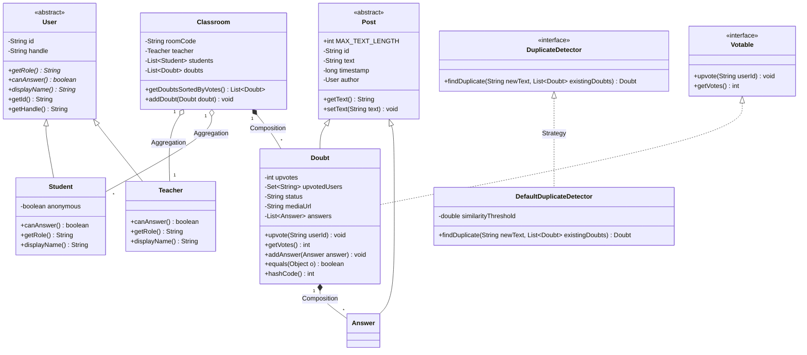

# 🎓 Doubt Undo? - Java Spring Boot OOP Refactored Backend

A live classroom doubt-clearing web application refactored into **Java 17+ Spring Boot** using **Maven**, demonstrating core Object-Oriented Programming (OOP) concepts, clean architecture, and thread safety without modifying original frontend behavior or adding unnecessary feature bloat.

---

## 🚀 Quick Start & How to Run

### **Prerequisites**
- Java 17 or higher (`java -version`)
- Maven (or use included `.\mvn.cmd` wrapper script)

### **Run Application**
```bash
# Option 1: Using system Maven
mvn spring-boot:run

# Option 2: Using included Maven wrapper script (Windows)
.\mvn.cmd spring-boot:run
```

The Spring Boot REST & Netty Socket.IO server will start:
- **Socket.IO Real-Time Server**: Running on `http://localhost:3001`
- **Spring Boot REST API**: Running on `http://localhost:8080` (or `http://localhost:3001` socket adapter)

---

## 🏗️ Object-Oriented Programming (OOP) Concepts Implementation

| # | OOP Concept | Key File / Class | Description & Demonstration |
|---|---|---|---|
| **1** | **Abstraction** | [`User.java`](src/main/java/com/doubtundo/model/User.java)<br>[`Votable.java`](src/main/java/com/doubtundo/model/Votable.java) | `abstract class User` defines contractual abstract methods `canAnswer()`, `getRole()`, and `displayName()`. `interface Votable` defines upvote behavior contract. |
| **2** | **Inheritance** | [`Student.java`](src/main/java/com/doubtundo/model/Student.java)<br>[`Teacher.java`](src/main/java/com/doubtundo/model/Teacher.java)<br>[`Post.java`](src/main/java/com/doubtundo/model/Post.java)<br>[`Doubt.java`](src/main/java/com/doubtundo/model/Doubt.java)<br>[`Answer.java`](src/main/java/com/doubtundo/model/Answer.java) | `Student` & `Teacher` extend `User`. `Doubt` and `Answer` extend abstract class `Post(id, text, timestamp, author)`. |
| **3** | **Polymorphism** | [`Student.java`](src/main/java/com/doubtundo/model/Student.java)<br>[`Teacher.java`](src/main/java/com/doubtundo/model/Teacher.java)<br>[`ClassroomService.java`](src/main/java/com/doubtundo/service/ClassroomService.java) | **Method Overriding**: `canAnswer()` returns `false` for Student, `true` for Teacher. `displayName()` hides anonymous student identities.<br>**Method Overloading**: `addDoubt(room, author, text)` vs `addDoubt(room, author, text, isAnonymous)`. |
| **4** | **Encapsulation** | [`Post.java`](src/main/java/com/doubtundo/model/Post.java)<br>[`Doubt.java`](src/main/java/com/doubtundo/model/Doubt.java) | All fields private. Input validation in setters (`MAX_TEXT_LENGTH = 500`). Vote state modified strictly through controlled `upvote()` / `toggleUpvote()` methods. |
| **5** | **Composition & Aggregation** | [`Classroom.java`](src/main/java/com/doubtundo/model/Classroom.java)<br>[`Doubt.java`](src/main/java/com/doubtundo/model/Doubt.java) | **Aggregation**: `Classroom` contains `Teacher` and `List<Student>`.<br>**Composition**: `Classroom` owns `List<Doubt>`, and `Doubt` owns `List<Answer>`. |
| **6** | **Strategy Pattern** | [`DuplicateDetector.java`](src/main/java/com/doubtundo/strategy/DuplicateDetector.java)<br>[`DefaultDuplicateDetector.java`](src/main/java/com/doubtundo/strategy/DefaultDuplicateDetector.java) | Interface-based strategy for calculating text similarity (Levenshtein distance) to identify and upvote duplicate doubts automatically. |
| **7** | **Custom Exceptions** | [`InvalidRoomCodeException.java`](src/main/java/com/doubtundo/exception/InvalidRoomCodeException.java)<br>[`DuplicateVoteException.java`](src/main/java/com/doubtundo/exception/DuplicateVoteException.java)<br>[`UnauthorizedActionException.java`](src/main/java/com/doubtundo/exception/UnauthorizedActionException.java)<br>[`GlobalExceptionHandler.java`](src/main/java/com/doubtundo/exception/GlobalExceptionHandler.java) | Custom domain exceptions handled by `@ControllerAdvice` to return standardized JSON error responses. |
| **8** | **Collections & Generics** | [`ClassroomManager.java`](src/main/java/com/doubtundo/util/ClassroomManager.java)<br>[`Classroom.java`](src/main/java/com/doubtundo/model/Classroom.java) | Concurrent collections (`ConcurrentHashMap<String, Classroom>`, `CopyOnWriteArrayList<Student>`), `List<Doubt>`, and `Comparator` to sort doubts by upvotes descending. |
| **9** | **Extras** | [`ClassroomManager.java`](src/main/java/com/doubtundo/util/ClassroomManager.java)<br>[`Doubt.java`](src/main/java/com/doubtundo/model/Doubt.java) | **Singleton**: Thread-safe `ClassroomManager`.<br>**Static & Final**: `totalDoubtsCounter`, `MAX_TEXT_LENGTH`.<br>**Thread Safety**: `synchronized upvote()`.<br>**Entity Contract**: Overridden `equals()` and `hashCode()` on `Doubt`. |

---

## 📊 UML Class Diagram



---

## 🧪 Unit Testing

Unit tests cover critical backend workflows:
- **Upvoting**: Verifies vote count increments.
- **Duplicate Vote**: Verifies double voting triggers `DuplicateVoteException`.
- **Unauthorized Answer**: Verifies Students attempting to answer doubts trigger `UnauthorizedActionException`.

Run unit tests via:
```bash
.\mvn.cmd test
```

---

## 💡 Viva Questions & Answers

#### **Q1. How does Abstraction differ from Encapsulation in your implementation?**
> **Answer**: 
> - **Abstraction** focuses on *what* an object does rather than *how* it does it. We demonstrate this via `abstract class User` and `interface Votable`, exposing abstract contracts (`canAnswer()`, `upvote()`) without exposing concrete subclass details.
> - **Encapsulation** focuses on hiding internal state and wrapping data with methods. In `Post.java` and `Doubt.java`, fields are private, setters validate length constraints (`MAX_TEXT_LENGTH`), and `upvotes` can only be modified through controlled methods like `upvote()`.

#### **Q2. Where is Polymorphism used in the backend?**
> **Answer**: 
> - **Method Overriding (Dynamic Polymorphism)**: `Student` and `Teacher` override `canAnswer()` and `displayName()` from `User`. When `user.canAnswer()` is evaluated at runtime in `ClassroomService`, Java executes the appropriate subclass implementation.
> - **Method Overloading (Static Polymorphism)**: `addDoubt(room, author, text)` and `addDoubt(room, author, text, isAnonymous)` in `ClassroomService` provide compile-time polymorphic method signatures.

#### **Q3. Why did you use the Strategy Pattern for Duplicate Doubt Detection?**
> **Answer**: 
> By introducing `interface DuplicateDetector`, we decouple the detection algorithm from `ClassroomService`. If we want to replace `DefaultDuplicateDetector` (Levenshtein similarity) with an AI or TF-IDF embedding model in the future, we can simply swap the strategy implementation without modifying `ClassroomService` or existing client code.

#### **Q4. How is thread safety ensured during upvoting?**
> **Answer**: 
> Multi-threaded WebSocket connections can receive simultaneous upvote requests for the same doubt. In `Doubt.java`, the `upvote()` and `toggleUpvote()` methods are marked with `synchronized`, ensuring atomic updates to the `upvotes` counter and thread-safe operations on `upvotedUsers`.

#### **Q5. Why is `ClassroomManager` implemented as a Singleton?**
> **Answer**: 
> `ClassroomManager` manages global in-memory session state across all WebSocket connections and REST requests. Implementing it as a double-checked locking thread-safe Singleton ensures exactly one instance exists across the entire Spring application lifecycle.
